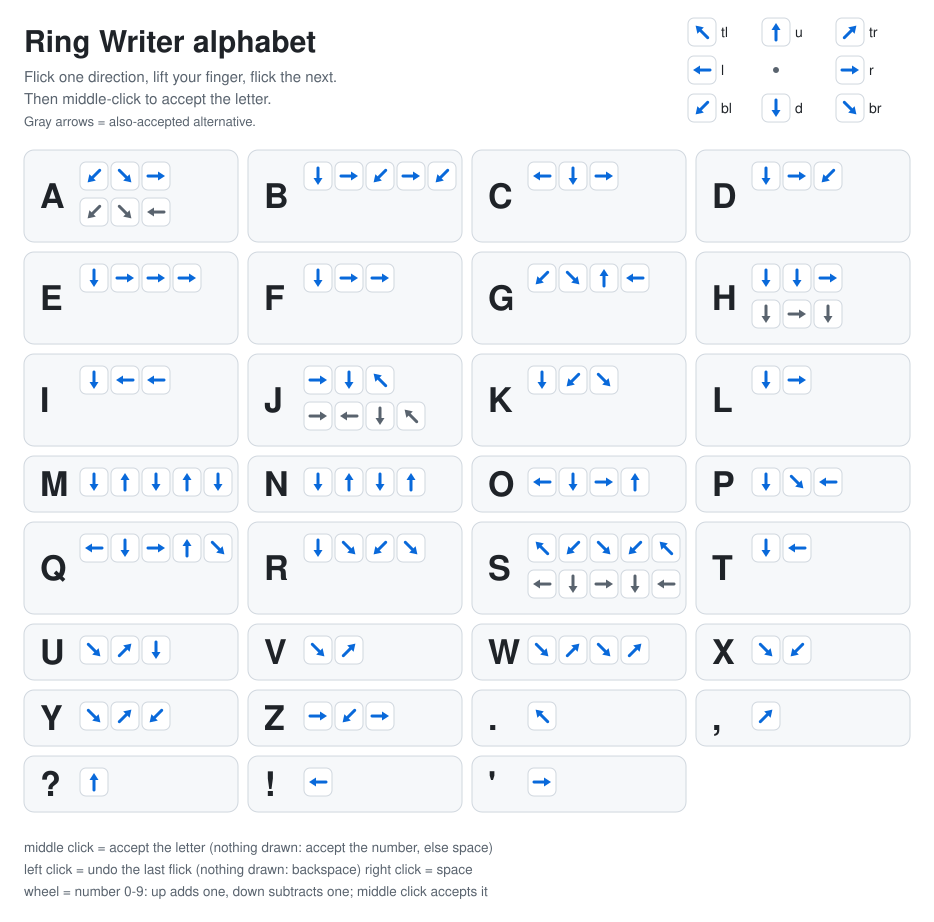

# Ring Writer

Write with a cheap Bluetooth "TikTok scroll" ring (the **D06**) by flicking its tiny touchpad one direction at a time.
No screen to look at, no autocomplete: every letter is a short, fixed sequence of direction flicks that you choose.

```
D06 ring ──BLE──▶ ESP32-S3 (firmware/ring_host) ──USB serial──▶ ring_writer.py ──▶ text + notes/
```

The ESP32-S3 is a Bluetooth LE host: it pairs with the ring and prints every mouse report over USB serial.
`ring_writer.py` turns those reports into flicks, flicks into letters, and saves what you write.



Full reference with arrow pictograms: [docs/GUIDE.md](docs/GUIDE.md)

## How you write

1. Flick the pad in one direction (8 directions: `u tr r br d bl l tl`), then **lift your finger**.
2. Flick the next direction, lift, and so on. For example **Z** is `r`, `bl`, `r` (right, down-left, right).
3. **Middle click** to accept the letter. The display shows what you have drawn so far (`d r =L`) and which letters it could still become.

| Control | Does |
|:--|:--|
| Flick | adds a direction to the letter |
| Middle click | accepts the letter (or the suggested one, see below), else the selected number or mark, else inserts a space |
| Left click | undoes the last flick, else backspace |
| Right click | space |
| Wheel up | a number: from rest each tick up adds one (0-9), each tick down subtracts one; middle click accepts it |
| Wheel down | punctuation: from rest, scroll down to walk through `. , ? ! ' " - : ; ( ) / @ & # $ % + = * _`, up to go back; middle click inserts the one shown |

**Suggestions.** If your flicks spell no letter, the screen shows the best guess (for example `br u br tr =?` with `~W? mid=ok`). Nothing changes until you middle-click:
middle click takes the guess, left click undoes a flick so you can fix it yourself. It only guesses when one letter is clearly the best (a flick that landed near a
direction boundary counts as evidence, then any single flick off by 45 degrees, then one stray or missing flick); ties are shown (`A/F/H?`) and not applied; a sequence that is
already a letter is never replaced. Approved corrections are logged to `notes/corrections.log` so the thresholds can be tuned. `--no-suggest` turns it off.
`python ring_writer.py --check` lists letters that are one slip apart (a slip between them cannot be noticed).

The first letter of the text, and the first after `. ? !`, is a capital. Punctuation sticks to the word before it.

## Quick start

Needs a D06 ring, an ESP32-S3 board with native USB, and macOS or Linux (the terminal UI uses `termios`).

**1. Flash the ESP32-S3**
```bash
arduino-cli core install esp32:esp32
arduino-cli lib install NimBLE-Arduino
arduino-cli compile --fqbn esp32:esp32:esp32s3 --board-options CDCOnBoot=cdc firmware/ring_host
arduino-cli upload  --fqbn esp32:esp32:esp32s3 --board-options CDCOnBoot=cdc -p /dev/cu.usbmodemXXXX firmware/ring_host
```
`CDCOnBoot=cdc` is what makes serial output appear over the native USB port. If an upload fails, hold BOOT, tap RESET, release BOOT.

**2. Free the ring.** A BLE ring talks to one device at a time. Turn Bluetooth off on your computer (or forget the D06), wake the ring,
and let the ESP32 connect. Watch it with `arduino-cli monitor -p /dev/cu.usbmodemXXXX -c baudrate=115200`; you should see `Connected`
and then lines like `[id 3 h45] 00 07 00 20 00 00 -> btn=00 dx=7 dy=32 wheel=0` as you use the pad. The first connect after a reset
sometimes needs a retry; the firmware rescans by itself. **Close the monitor before step 4**: only one program can hold the port.

**3. Python**
```bash
python3 -m venv .venv && source .venv/bin/activate
pip install -r requirements.txt
python ring_writer.py --cheatsheet          # print the alphabet
python ring_writer.py --demo                # try it with the keyboard, no hardware (numpad keys are flicks)
```

**4. Calibrate once, then write**
```bash
python ring_writer.py --port /dev/cu.usbmodemXXXX --calibrate    # flick up, right, down, left, three times each
python ring_writer.py --port /dev/cu.usbmodemXXXX
```
Calibration measures how the pad is rotated and stretched (the ring's axes are not square) and saves it to `calibration.json`.
Without it, diagonals are often misread.

## Make the alphabet yours

[alphabet.json](alphabet.json) is the whole alphabet. Each character maps to one or more sequences:

```json
"A": ["bl br r", "bl br l"],
"Z": "r bl r"
```

- Directions are `u d l r tl tr bl br`. A character may list several sequences and all are accepted.
- Two characters may not share an exact sequence (the file is rejected with a clear message).
- A sequence may be the start of a longer one (`d r` is **L**, and also the start of **F** = `d r r`). That is fine because you accept the letter yourself.
- Punctuation is on the wheel, not on strokes: edit the `"punctuation"` list. You can still add a `"symbols"` group (character -> sequence) if you want some marks on strokes.

After editing, regenerate the guide and picture: `python tools/make_guide.py`.

## Tuning

| Option | Meaning |
|:--|:--|
| `--min-flick N` | shortest flick that counts, in ring units (default 100). Raise it if you get ghost flicks, lower it if flicks are missed. `--calibrate` suggests a value. |
| `--gap S` | pause that counts as lifting your finger (default 0.12 s). A flick is only accepted once your finger has been still this long, so this is the biggest source of delay: smaller = faster response, but too small can split one flick into two. |
| `--lockout S` | seconds the pad is ignored after a click or wheel tick (default 0.35 s), because a click jiggles the pad. Smaller = the next letter can start sooner. |
| `--measure` | measures your ring's report rate, then the pad jiggle after the middle, left and right buttons and the wheel (about 70 s), and suggests `--gap` and `--lockout`. Close any other program using the port first. |
| `--flip` | reverse the wheel (swaps which direction counts numbers and which walks punctuation). |
| `--glyphs arrows\|names` | how flicks are drawn on screen: `arrows` (↘ ↗, the default, for a terminal) or `names` (`br tr`, plain ASCII for a small OLED that has no arrow glyphs). |
| `--raw` | type the stroke pictograms instead of letters (`↘↗↘↗ ↓→ ...`). Each flick appears at once; middle click ends a letter and shows what it would decode to (`= W`); left click removes the last arrow. Handy for seeing what the ring really sent and for designing alphabets. |
| `--no-suggest` | turn the correction suggestions off. |
| `--soft-angle DEG` | a flick this far from the centre of its direction also remembers the neighbouring direction as a runner-up (default 12). |
| `--screen COLSxROWS` | size of the display drawn in the terminal (default `21x4`, a 128x32 OLED with a 6x8 font). Plain ASCII, so what you see is what a tiny display would show. |
| `--notes-dir DIR` | where notes are saved (default `notes/`, one file per session, rewritten after every change). |
| `--alphabet FILE` | use a different alphabet file. |

**Your settings.** `python ring_writer.py --port ... --measure` (about 70 s) measures your ring and saves `--gap`, `--lockout` and the port to `settings.json` (per device, git-ignored);
the app loads it automatically, and options on the command line still win. Delete `settings.json` to go back to the built-in defaults.

If it says `Resource busy`, another program (usually a serial monitor) has the port.

## Status

A working prototype. The full history, measurements and open issues are in **[PROGRESS.md](PROGRESS.md)**; the step-by-step story of how it was built is in [docs/DEVLOG.md](docs/DEVLOG.md).
- Verified on a real ring: it pairs with the ESP32-S3 and its raw reports (motion, wheel, buttons) stream over USB serial; calibration, timing measurement and a first writing session (L, I, H, numbers, space, backspace) worked.
- Verified in software only: correction suggestions, the terminal arrows and raw mode (`python -m unittest discover -s tests`, 50 tests, plus a simulated ring driving the live loop).
- **Not yet done:** accuracy numbers from real hands over longer use. Expect to adjust `--min-flick`, the timing settings and the alphabet as you learn what is comfortable.
- The pad reports relative motion only, so there is no absolute position; that is why letters are built from direction flicks.

## Hardware

[hardware/enclosure](hardware/enclosure) holds the parametric CAD for a wearable: a watch-style head for the ESP32-S3 Super Mini, battery, OLED and
SD module, built as one link of a print-in-place chain band with enclosed pins and a snap clasp. It is designed and checked by computer but **not yet printed**,
and most part sizes are placeholders: read its README before printing.

## Roadmap

- Port the writer from Python to the ESP32-S3 itself, so it runs without a computer.
- A small OLED/LCD for the 4-row display, and an SD card for notes.
- Haptic confirmation for each flick, for writing without looking.
- Optional extras later (word shortcuts, more symbols), kept out of the core on purpose.

## Layout

```
hardware/enclosure the 3D-printable wrist unit: parametric CAD, chain band with snap clasp (see its README)
ring_writer.py     the app: writer state, terminal UI, command line
flick.py           flick detector and calibration
alphabet.py        loads alphabet.json
hid_report.py      parses the mouse reports printed by the firmware
alphabet.json      your alphabet
firmware/ring_host the ESP32-S3 BLE host sketch
tools/make_guide.py  builds docs/GUIDE.md and docs/alphabet.svg from alphabet.json
tests/             unit tests (no hardware needed)
```
